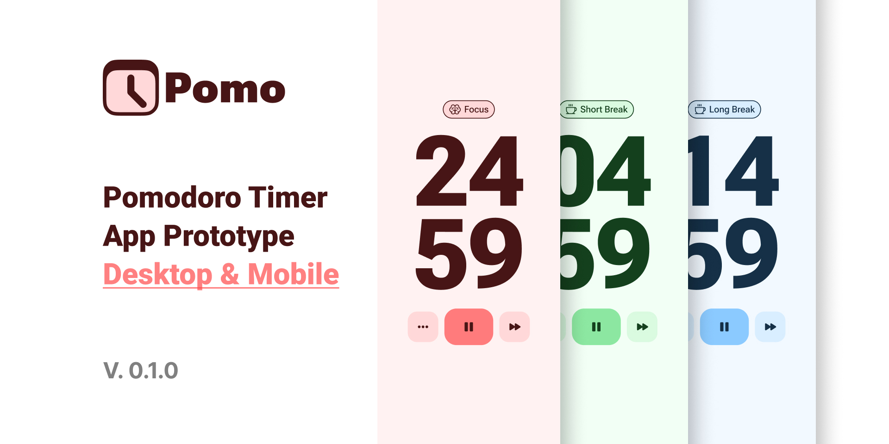

<p align="center">
    
</p>
<h1 align="center" style="margin-top: -15px;">Pomodoro Clock</h1>

<div style="width: 100%; height: 1px; background-color: #fff;"></div>

<h2 align="center" style="margin-top: 15px;">Control your time</h2>

<p align="center" style="font-size: 19px;">
The Pomodoro Technique is a time management method developed by Francesco Cirillo in the late 1980s. It uses a kitchen timer to break work into intervals, typically 25 minutes in length, separated by short breaks. Each interval is known as a pomodoro, from the Italian word for tomato, after the tomato-shaped kitchen timer Cirillo used as a university student
</p>

</img>

<p align="center" style="font-size: 19px;">Design: <a href="https://www.figma.com/community/file/1112830528857083939">Figma</a></p>

<h1 style="display: flex; align-items: center; margin-top: 35px;"> <span>Features</span></h1>

<ul>
    <li style="font-size: 18px;">New functions</li>
    <li style="font-size: 18px;">Add options in the settings</li>
    <li style="font-size: 18px;">Make the code better</li>
    <li style="font-size: 18px;">Add new technologists</li> 
</ul>

<p style="font-size: 15px; margin-top: 30px;">Features technologists</p>


<h1 style="display: flex; align-items: center; margin-top: 65px;"> <span>About Porject</span></h1>

<h2>Used technologists:</h2>


<p style="font-size: 18px;">Programmes: </p>


<h2 style="margin-top: 50px;">Structure:</h2>


``` bash
.
├── audio                    
├── css
│   ├── main.css          
│   └── darkModeElements.scss
├── img                     
├── node_modules                 
├── scripts              
│   ├── main.js
│   └── modules
├── index.html
├── pacage-lock.json
├── pacage.json
├── README.md
├── tailwind.config.js
└── input.css
```

<h1>Author is:</h1>

<div style="display: flex; align-items: center; max-width: 520px; border: 1px solid #8b949e; border-radius: 5px; padding: 20px 30px; margin: 25px auto;">
    
    <div style="margin-left: 30px; margin-top: -20px;">
        <h1>Zaccal</h1>
        <p style="margin-top: -20px;">
        Hello, my name is Adil, I learn on the Frontend developer. I use language programming JavaScript, nice to meet you).
        </p>
    </div>
</div>

<p align="center" style="font-size: 19px;">Profile: <a href="https://github.com/Zaccal">Zaccal</a></p>